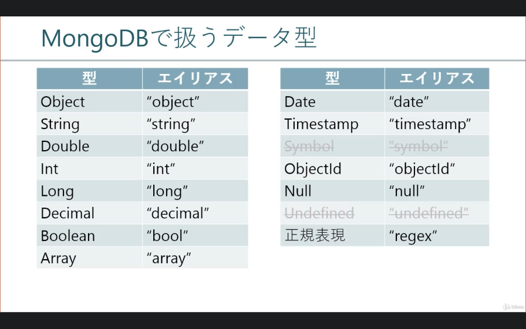

for Windows
## 

## How to start

```
■WindowsへMongoDBをインストール

    インストーラーをダウンロード
    >> MongoDB Enterprise ダウンロード

    インストール
    サービスは登録しないことに注意。

    環境変数の登録
    Path に インストールした MongoDB の bin ディレクトリを追加

    ディレクトリ作成

        C:\MongoDB\server
            │  mongod.cfg
            │  
            ├ data
            └ log

    サービスへ登録

        mongod --config "C:\MongoDB\server\mongod.cfg" --install


■サーバー起動/終了

    サーバー起動

        mongod --config <コンフィグファイルパス>

    または

        mongod --bind_ip <リッスンIP> --port <ポート番号> --dbpath <DBファイル保存先> --logpath <ログファイルパス>

    サーバー終了
    Ctrl + C 


■設定ファイル

    ファイルはYAML形式

    基本設定は以下のような設定ファイル。

        systemLog:
          destination: file
          path: C:\MongoDB\sever\log\mongod.log
          logAppend: true
        storage:
          journal:
            enabled: true
          dbPath: C:\MongoDB\sever\data
        net:
        #  bindIp: 127.0.0.1,192.168.11.100
        #  port: 27017
          bindIpAll: true
```

shutdown
###

* db.adminCommand({shutdown: 1, force: true})

startup
###
* mongod --dbpath <path> --logpath=[full_path]
* mongod --config [config_full_path]


config
###
```yaml
systemLog:
  destination: file
  path: C:\MongoDB\server\5.0\log\mongod.log
  logAppend: true
storage:
  journal:
    enabled: true
  dbPath: C:\MongoDB\server\5.0\data
net:
  bindIpAll: true
  port: 27017
```

DATA投入
###
* mongo 127.0.0.1:27017/booklog insert.js

DB操作
###
* use <DATABASE>
* db
* show dbs
* db.createCollection("test")
* db.dropDatabase()

コレクション操作
###
* db.createCollection("COLLECTION")
* db."SOURCE".renameCollection("TARGET", "DROP[true|false]")
* db."TARGET".drop()

ドキュメント操作
###
* db."TARGET".insert("DOCUMENT")
* db."TARGET".find("QUERY")
* db."TARGET".update("QUERY", "UPDATE", "OPTION")
  * OPTION {multi: true}
* db."TARGET".remove("QUERY", "JUSTONE")

> document-op1/insert.js, update.js, drop.js

```json
{
  email: "sachiko.sato@sample.co.jp",
  password: "P@ssword",
  name: "佐藤 幸子"
}
```

データ型
###



ドキュメント件数取得
###

* db."TARGET".count("QUERY")
* db."TARGET".find("QUERY").count()

> document-op1/01-counts.js

検索結果のソート
###

カーソル／検索結果セットに対するポインタ
* db."collection".find("QUERY")

* cursor.sort("ORDER")
  * {order: [1| -1]}

検索結果の制限
###

* cursor.skip("OFFSET")
* cursor.limit("LIMIT")

インデックスの作成/確認/削除
###
* db."TARGET".createIndex("KEYS", "OPTION")
  * OPTION: {name: index名}
* db."TARGET".getIndexes()
* db."TARGET".dropIndex("NAME")

一意制約作成
###
* db."TARGET".createIndex("KEYS", "OPTION")
  * OPTION: {unique: true}

## まとめ４
```
■データベース操作

    データベース作成

        use <DATABASE>

    接続中データベース名確認

        db

    データベース一覧表示

        show dbs

    データベース名変更

        db.copyDatabase(<OLD_DATABASE>, <NEW_DATABASE>)
        use <OLD_DATABASE>
        db.dropDatabase()

    データベース削除

        use <DATABASE>
        db.dropDatabase()


■コレクション操作

    コレクション作成

        db.createCollection(<COLLECTION>)

    コレクション一覧表示

        show collections

    コレクション名変更

        db.<SOURCE_COLLECTION>.renameCollection(<TARGET_COLLECTION>, <DROP>)

    コレクション削除

        db.<COLLECTION>.drop()


■ドキュメント操作

    ドキュメント作成

        db.<COLLECTION>.insert(<DOCUMENTS>)

    ドキュメント一覧表示

        db.<COLLECTION>.find(<QUERY>)

    ドキュメント更新

        db.<COLLECTION>.update(<QUERY>, <UPDATE>, <OPTION>)

    ドキュメント削除

        db.<COLLECTION>.remove(<QUERY>)

    ドキュメント件数取得

        db.<COLLECTION>.count(<QUERY>)

        db.<COLLECTION>.find(<QUERY>).count()

    ドキュメント取得結果のソート

        db.<COLLECTION>.find(<QUERY>).sort(<ORDER>)

    ドキュメント取得制限

        db.<COLLECTION>.find(<QUERY>).sort(<ORDER>).skip(<OFFSET>).limit(<LIMIT>)


■インデックス/一意制約

    インデックス作成

        db.<COLLECTION>.createIndex(<KEYS>, <OPTIONS>)

    ※一意制約は OPTIONS に { unique: true } を指定。

    インデックス確認

        db.<COLLECTION>.getIndexes()

    インデックス削除

        db.<COLLECTION>.dropIndex(<NAME>)
```


関係演算子
###

* $gt, $gte
* $lt, $lte
* $in
* 日付の比較 ISODate("yyyy-mm-ddThh:mm:ss+hh:mm)

論理演算子
###

* 論理積 $and: ["EXP1", "EXP2"]
* 論理和 $or: ["EXP1", "EXP2"]
* 否定 $not

評価演算子
###

* 正規表現 $regex /a/b/
* アグリゲーション $expr: expr

要素演算子
###
* $exists: [true|false]
* $type: "type string"


配列演算子
###
* 要素と一致 $elemMatch: {expr1, }
* 要素数 $size

まとめ（ドキュメント検索で使う演算子）
##

```
本セクションでは検索クエリの条件演算子を学習しました。以下に本セクションで学習した演算子をまとめましたので、実際に実行して試してみましょう。


■検索クエリ

    db.<COLLECTION>.find(<QUERY>)

本セクションは上記クエリの [QUERY] に関する学習でした。以下に学習した演算子をまとめますので、実際に動かしながら復習しましょう。


■関係演算子

    等値（＝）

        { <FIELD>: { $eq: <VALUE> } }

    非等値（≠）

        { <FIELD>: { $ne: <VALUE> } }

    より大きい（＞）

         { <FIELD>: { $gt: <VALUE> } }

    より大きい（≧）

        { <FIELD>: { $gte: <VALUE> } }

    より大きい（＜）

         { <FIELD>: { $lt: <VALUE> } }

    より大きい（≦）

        { <FIELD>: { $lte: <VALUE> } }

    いずれか

        { <FIELD>: { $in: [<VALUE1>, <VALUE2>, ...] } }


■論理演算子

    論理積

        { $and: { <EXPRESSION1>, <EXPRESSION2>, ... } }

    論理和

        { $or: { <EXPRESSION1>, <EXPRESSION2>, ... } }

    論理否定

        { $not: <EXPRESSION> }


■評価演算子

    正規表現

        { <FIELD>: { $regex: <REGEX> } }

    アグリゲーション

        { $expr: <EXPRESSION> }


■要素演算子

    フィールドの存在

        { <FIELD>: { $exists: <BOOL> } }

    バリューの型

        { <FIELD>: { $type: [ <TYPE1>, <TYPE2>, ... ]  } }


■配列演算子

    配列要素に一致

        { <FIELD>: { $elemMatch: { <EXPRESSION1>, <EXPRESSION2>, ... } } }

    配列要素数

        { <FIELD>: { $size: [SIZE] } }
```